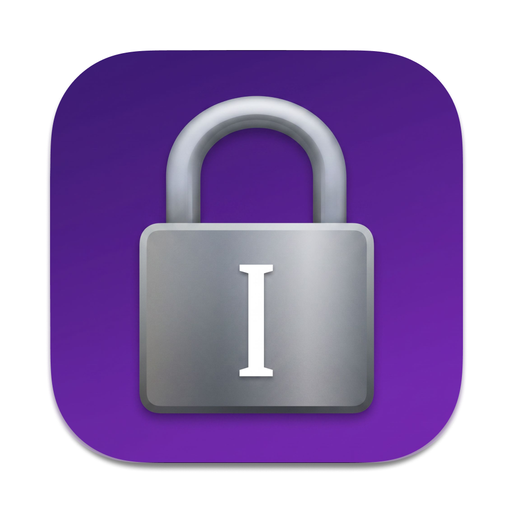

# TypeLock

TypeLock is a lightweight macOS menu bar app that keeps the right input method active in every app. Choose a global default, add app-specific rules, and TypeLock restores the expected source whenever macOS or another app changes it.

TypeLock works on macOS Ventura 13 or higher.

- [Features](#features)
- [Install](#install)
- [Usage](#usage)
- [App Rules](#app-rules)
- [How It Works](#how-it-works)
- [FAQ](#faq)
- [Development](#development)
- [Sponsor](#sponsor)
- [License](#license)

## Features

- Set a global default input method from the menu bar.
- Assign a specific input method to individual apps.
- Leave selected apps unmanaged.
- Restore the expected input method after unwanted switches.
- Handle non-activating panels such as Raycast and 1Password Quick Access.
- Launch automatically when you log in.
- Keep all settings local, with no accounts or analytics.
- Use a native, lightweight, open-source macOS app.

## Install

TypeLock currently builds from source. You need Swift 5.9 or newer.

```sh
git clone https://github.com/tehjones/typelock.git
cd typelock
./bundle.sh
cp -R TypeLock.app /Applications/
open /Applications/TypeLock.app
```

On first launch, allow TypeLock in **System Settings → Privacy & Security → Accessibility**. TypeLock needs this permission to identify which app or panel owns keyboard focus.

## Usage

1. Click the TypeLock icon in the menu bar.
2. Choose an input method, such as **ABC**, as the global default.
3. TypeLock now restores that input method whenever another app or macOS changes it.
4. Open **App Rules…** to configure exceptions or app-specific input methods.
5. Quit TypeLock when you want macOS to manage input methods normally.

## App Rules

Open **App Rules…**, click **Add App…**, then choose what TypeLock should do in that app.

| Rule | Behavior |
| --- | --- |
| No app rule | Use the global default input method. |
| Specific input method | Override the global default while that app has focus. |
| **Don’t Enforce** | Let the app manage its own input method. |

## How It Works

TypeLock watches input-source changes, app activation, and focused-app changes. It resolves the active app and applies that app's assigned input method, the global default, or no action for unmanaged apps.

Settings stay in macOS `UserDefaults`. **Launch at Login** uses macOS Service Management.

See [ARCHITECTURE.md](ARCHITECTURE.md) for implementation details.

## FAQ

### Why does TypeLock need Accessibility permission?

Some panels accept keyboard input without becoming the frontmost app. Accessibility APIs let TypeLock identify the window or panel that actually owns focus.

### Does TypeLock read my keystrokes?

No. TypeLock reads the focused app and current input-source identifiers. It does not record keystrokes, connect to a server, or send analytics.

### How do I make TypeLock ignore an app?

Open **App Rules…**, add the app, and choose **Don’t Enforce**.

### How do I use a different input method in one app?

Open **App Rules…**, add the app, and select its input method. That choice overrides the global default while the app has focus.

### How do I start TypeLock automatically?

Choose **Launch at Login** from the TypeLock menu.

## Development

Build the executable:

```sh
swift build
```

Build a release app bundle:

```sh
./bundle.sh
```

The bundle is created at `TypeLock.app` in the project directory. By default it
uses an ad-hoc signature, so Accessibility permission must be granted again
after changed builds. Use a stable signing identity to preserve permission:

```sh
TYPELOCK_SIGNING_IDENTITY="Developer ID Application: Your Name (TEAMID)" ./bundle.sh
```

## Sponsor

TypeLock is sponsored by [Musing Image](https://musingimage.com/).

## License

[MIT](./LICENSE)
